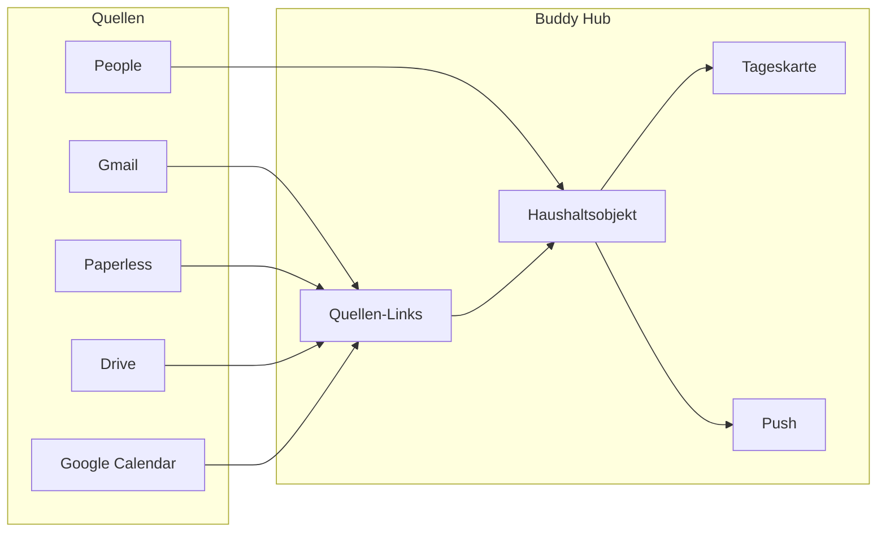

# Buddy Service Hub — Konzept

Buddy ist die **Haushalts-Wahrheit**: ein reales Ding (Rechnung, Paket, Reise, Termin) hat **mehrere Quellen und Spiegel**, einen Status und oft eine Person — nicht «noch ein Client» für Google/Paperless.

## Leitbild

**Heute (Ausgangspunkt):** dokument-zentriert (Paperless-FKs); Mail über soft IDs; Familie/Push kaum im Graph.

**Ziel:** polymorphe **Quellen-Links** + klare Objekttypen; Patterns wiederverwenden (`inbox_task_state`, `activity_log`, `mail_applied_links`).

## Kernmodell

### Objekttypen (Welle 1)

| Typ | Beispiel | Primär |
|-----|----------|--------|
| `document` | Rechnung, Ticket-PDF | Paperless |
| `shipment` | Paket / Tracking | Mail |
| `appointment` | Arzt, Lieferfenster | Calendar / Mail |
| `trip_leg` | Flug, Hotel | TravelBuddy |
| `deadline` / `task` | Frist, Aufgabe | Extract / Tasks |

### `buddy_source_links`

- `entity_type` + `entity_id`
- `source_kind`: `paperless` | `gmail_message` | `gmail_thread` | `drive_file` | `google_event` | `google_task` | `trilium` | `url`
- `source_id`, optional `url` / `label`
- `role`: `primary` | `mirror` | `related`

Paperless oft **primary**, Drive **mirror**, Gmail **related**. Bestehende FKs bleiben; Links werden zusätzlich geschrieben.

### Personen

`family_members` als Identity; optional Google People; Mail-Absender → Member-Vorschlag.

## Service-Rollen

| Service | Rolle | Nicht |
|---------|-------|-------|
| Paperless | Primärarchiv OCR/PDF | — |
| Gmail | Signal → Triage/Apply | voller Mail-Client |
| Calendar/Tasks | Schreibziel + Agenda | Ersatz-Kalender |
| Drive | optionaler Spiegel + Teilen | zweites DMS |
| People | Adressen, Geburtstage | CRM |
| Push | Kontext-Aktionen | Spam-Digests |

## Drive-Spiegel

Nach Paperless-Import (und einmalige Migration aller bestehenden Docs):

- Ordnerstruktur: `BUDDY/{Jahr}/{Rubrik}/{paperlessId}-{Titel}.pdf`
- Link am Dokument (`drive_file`, role `mirror`)
- Paperless bleibt Wahrheit; Upload idempotent
- **Migrations-Status** ist dauerhaft sichtbar (auch bei 100 % synchron)

## Phasen

| Phase | Inhalt |
|-------|--------|
| A | `buddy_source_links` + Write Mail-Apply/Doc + Chips |
| B | Drive-Spiegel + Bulk-Migration + Status-UI |
| C | People: Adressen/Geburtstage + Member-Match |
| D | Objekt-Detail / verdichtete Tageskarte |
| E | Travel-Mail→Trip + Kontext-Push |

**Prinzipien:** eine Wahrheit in Buddy; Spiegel erlaubt; Pipelines erweitern; Scopes reconnecten; keine Gmail-Anhänge parallel zu Paperless in v1.

## Umsetzungsstand (Code)

| Phase | Status |
|-------|--------|
| A Quellen-Links | `buddy_source_links`, Write bei Paperless-Sync + Mail-Apply, Chips am Dokument |
| B Drive-Spiegel | Ordner `BUDDY/{Jahr}/{Rubrik}/…`, Job `drive_mirror`, Status-Panel unter Konto (auch bei 100 %) |
| C People | OAuth `contacts.readonly` + Probe-Modul; Geburtstage/Match folgen |
| D/E | Objekt-Detail-Chips; Tageskarte/Travel/Push als nächste Iteration |

**Wichtig:** Google unter Konto **neu verbinden** (Drive + Kontakte). Dann «Migration starten» — läuft in Batches weiter, bis `pending = 0`; der Fortschrittsbalken bleibt sichtbar.
